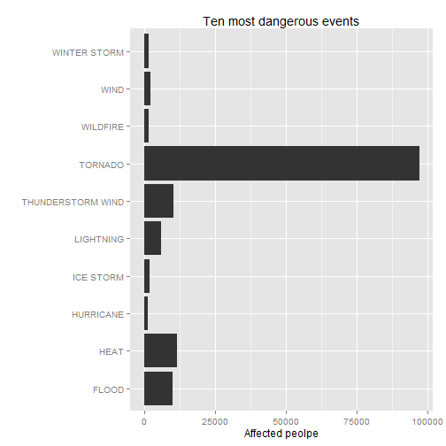
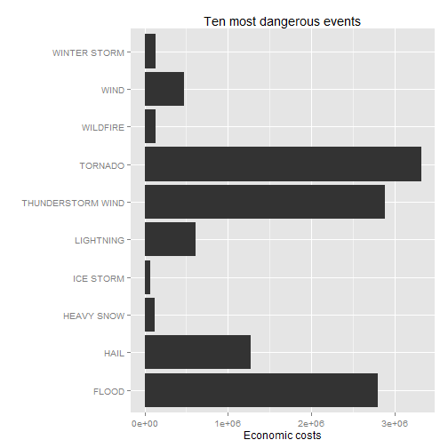

# Synopsis
Storms and other severe weather events can cause both public health and economic problems for communities and municipalities. Many severe events can result in fatalities, injuries, and property damage, and preventing such outcomes to the extent possible is a key concern.

This project involves exploring the U.S. National Oceanic and Atmospheric Administration's ([NOAA](http://www.noaa.gov/)) storm [database](https://d396qusza40orc.cloudfront.net/repdata%2Fpeer2_doc%2FNCDC%20Storm%20Events-FAQ%20Page.pdf). This database tracks characteristics of major storms and weather events in the United States, including when and where they occur, as well as estimates of any fatalities, injuries, and property damage.

# Data Processing
You can download the [storm data](https://d396qusza40orc.cloudfront.net/repdata%2Fdata%2FStormData.csv.bz2) used in this analysis, to check what's going on in this paper.

This code puts the data in *rawdata* variable:

```r
# download.file(url='https://d396qusza40orc.cloudfront.net/repdata%2Fdata%2FStormData.csv.bz2', destfile='stormdata.csv.bz2')
rawdata <- read.csv('stormdata.csv.bz2')
```

```
## Warning: cannot open file 'stormdata.csv.bz2': No such file or directory
```

```
## Error: cannot open the connection
```

Vamos a analizar los datos empezando por sus dimensiones. El conjunto de datos comprende 902297 observaciones de 37 variables cada una, concretamente:


```r
names(rawdata)
```

```
##  [1] "STATE__"    "BGN_DATE"   "BGN_TIME"   "TIME_ZONE"  "COUNTY"    
##  [6] "COUNTYNAME" "STATE"      "EVTYPE"     "BGN_RANGE"  "BGN_AZI"   
## [11] "BGN_LOCATI" "END_DATE"   "END_TIME"   "COUNTY_END" "COUNTYENDN"
## [16] "END_RANGE"  "END_AZI"    "END_LOCATI" "LENGTH"     "WIDTH"     
## [21] "F"          "MAG"        "FATALITIES" "INJURIES"   "PROPDMG"   
## [26] "PROPDMGEXP" "CROPDMG"    "CROPDMGEXP" "WFO"        "STATEOFFIC"
## [31] "ZONENAMES"  "LATITUDE"   "LONGITUDE"  "LATITUDE_E" "LONGITUDE_"
## [36] "REMARKS"    "REFNUM"
```

En este analisis nos vamos a fijar en los tipos de eventos (EVTYPE) registrados y las variables relacionadas con la salud de la población y costes económicos.

La clasificación de los eventos metereologicos no parece seguir una clasificación muy cuidada. Se trata de 985 tipos distintos de eventos, por ejemplo, veamos los 20 ultimos: 


```
##  [1] "WIND DAMAGE"             "WIND GUSTS"             
##  [3] "WIND STORM"              "WIND/HAIL"              
##  [5] "WINDS"                   "WINTER MIX"             
##  [7] "WINTER STORM"            "WINTER STORM HIGH WINDS"
##  [9] "WINTER STORM/HIGH WIND"  "WINTER STORM/HIGH WINDS"
## [11] "WINTER STORMS"           "Winter Weather"         
## [13] "WINTER WEATHER"          "WINTER WEATHER MIX"     
## [15] "WINTER WEATHER/MIX"      "WINTERY MIX"            
## [17] "Wintry mix"              "Wintry Mix"             
## [19] "WINTRY MIX"              "WND"
```

Antes de trabajar con estos datos vamos a convertir los *EVTYPE* a mayusculas. 


```r
events <- as.data.frame(toupper(events))
names(events)[1] = "EVTYPE"
```

Una vez normalizados los textos, se categorizan agregarando los eventos más genericos, tales como HURRICANE, HEAT, WIND, FLOOD, etc. 


# Questions:

## Across the United States, which types of events are most harmful with respect to population health?

```r
# Load ggplot2 library
library(ggplot2)
# Creamos un data frame con la suma de los injuries and fatalities por cada event type
human_damages <- aggregate(cbind(FATALITIES, INJURIES) ~ EVTYPE, rawdata, sum)
# Añadimos una variable con el total de daño humano
human_damages$TOTAL <- human_damages$FATALITIES + human_damages$INJURIES
# Ordenamos segun el total y representamos el TOP10
quest1 <- head(human_damages[order(-human_damages$TOTAL, -human_damages$FATALITIES, -human_damages$INJURIES), ], 10)
quest1
```

```
##                EVTYPE FATALITIES INJURIES TOTAL
## 544           TORNADO       5633    91346 96979
## 192              HEAT       2955     8780 11735
## 536 THUNDERSTORM WIND        754     9544 10298
## 111             FLOOD       1523     8603 10126
## 302         LIGHTNING        816     5230  6046
## 623              WIND        444     1928  2372
## 271         ICE STORM         89     1975  2064
## 621          WILDFIRE         90     1606  1696
## 634      WINTER STORM        216     1338  1554
## 255         HURRICANE        135     1331  1466
```

## Across the United States, which types of events have the greatest economic consequences?

```r
# Creamos un data frame con la suma de los damages por cada event type
cost<-aggregate(cbind(PROPDMG, CROPDMG) ~ EVTYPE , rawdata, sum)
# Añadimos una variable con el total del daño economico
cost$TOTAL <- cost$PROPDMG + cost$CROPDMG
# Ordenamos segun el total y representamos el TOP10
quest2 <- head(cost[order(-cost$TOTAL, -cost$PROPDMG, -cost$CROPDMG), ], 10)
quest2
```

```
##                EVTYPE PROPDMG CROPDMG   TOTAL
## 544           TORNADO 3212258  100019 3312277
## 536 THUNDERSTORM WIND 2677192  199363 2876555
## 111             FLOOD 2434047  363300 2797347
## 163              HAIL  688693  579596 1268290
## 302         LIGHTNING  603352    3581  606932
## 623              WIND  448943   21480  470423
## 634      WINTER STORM  134221    2479  136700
## 621          WILDFIRE  125148    9066  134214
## 213        HEAVY SNOW  122252    2166  124418
## 271         ICE STORM   66001    1689   67690
```

# Results

## Human impact
 

## Economic consequences
 
